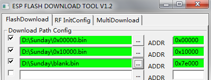
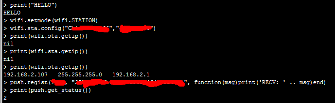
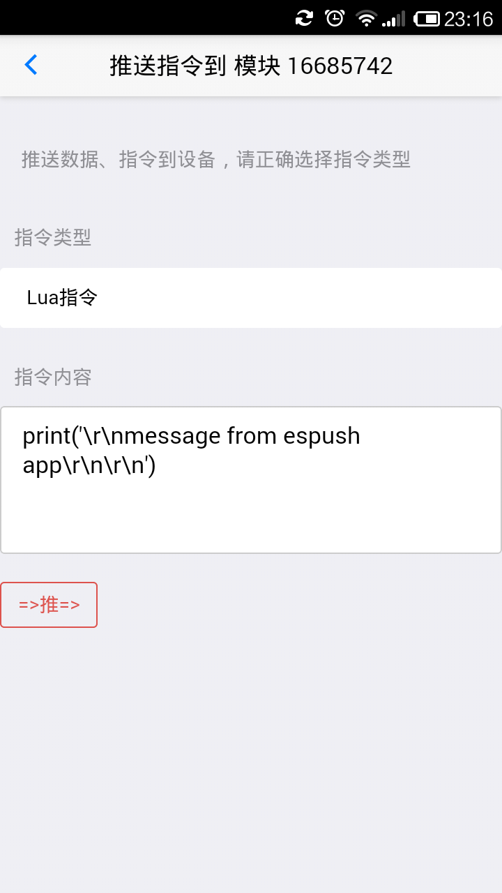
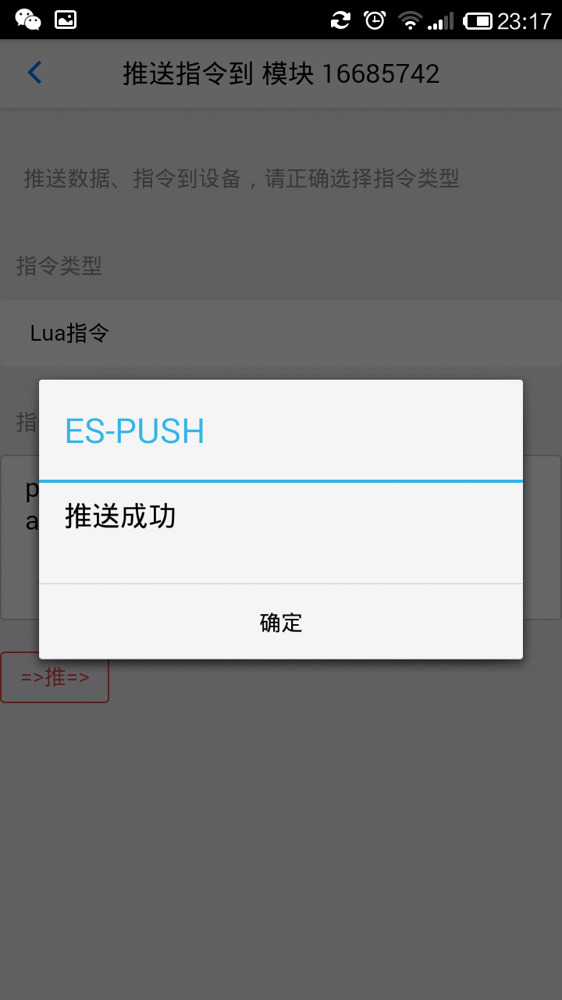
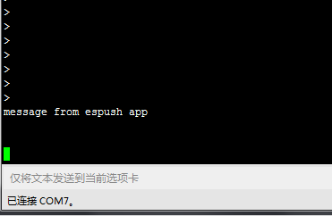
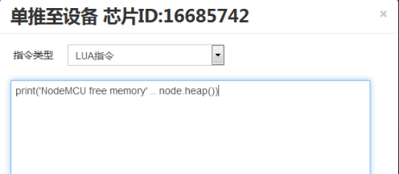
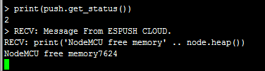

================
NodeMCU固件
================

如果你熟悉了使用AT固件的方式，那使用NodeMCU固件连上ESPUSH云，就和 **把大象关进冰箱** 一样容易。

----------------
基础使用
----------------

与AT固件类似，克隆ESPUSH官方github库并直接编译即可，参考以下命令：

.. code-block:: shell

    git clone https://github.com/pushdotccgzs/espush_nodemcu.git
    cd espush_nodemcu
    make clean && make

NodeMCU固件由于源码量巨大，编译时间较久，可能持续几分钟甚至十多分钟，请耐心等待，第一次编译完成，后续更改代码后再编译将变得迅速。关于编译环境搭建，参考 **进阶指南** 部分。如果你不愿意自己编译，可直接使用ESPUSH提供的预编译版，点此下载 https://espush.cn/web/down_roms/espush_nodemcu ，下载后按文件名所示，如下图所示，直接刷入即可。

使用NodeMCU固件在espush.cn操作步骤与AT固件完全一致，帐号不必重复注册，甚至设备类别也不用重复添加，使用AT固件现有的即可，开机后按如下步骤输入Lua指令（留意串口波特率设置，NodeMCU默认的波特率是9600，于AT固件所使用的115200有区别，留意设置），并对照下图。

.. code-block:: text

    -- 测试串口工具是否能输入与回显，以下以 '--' 开头的均为注释，不必输入
    > print("HELLO")
    HELLO
    -- 配置模块到STATION模式
    > wifi.setmode(wifi.STATION)
    -- 配置路由器的SSID于密码
    > wifi.sta.config("YOURSSID","YOURPWD")
    > print(wifi.sta.getip())
    nil
    > print(wifi.sta.getip())
    nil
    -- NodeMCU连接路由器有一定时延，获得IP地址后即可连接云平台
    > print(wifi.sta.getip())
    192.168.2.107	255.255.255.0	192.168.2.1
    -- 一条指令即可连接云平台，留意APPID为数字型，而APPKEY为字符串，需要使用引号括起来，第三个参数为收到数据后的回调函数。
    > push.regist(APPID, APPKEY, function(msg)print('RECV: ' .. msg)end)
    -- 同AT固件，返回状态为2时，代表状态为 ESPUSH_CONNECTED 已连接。
    > print(push.get_status())
    2
    -- 收到来自云端的数据，回调函数被自动调用，你可以定制你自己的回调函数，通过收到不同的指令进行功能分发
    > RECV: Message from ESPUSH

如下图所示：

下文主要阐述NodeMCU的 Lua API。

----------------
NodeMCU Lua API
----------------

由上文克制，最简单的使用Espush for NodeMCU的方式，只需要寥寥数行代码，严格意义上只有一行代码，即可连接云平台，并可远程推送数据及Lua指令，方便开发者。

**push.regist(appid, appkey, data_rcv_cb)**，主要的，最重要的函数，连入espush云环境，请指定正确的appid与appkey，错误的值将导致模块不断重试。参数 *data_rcv_cb* 为最终收到推送指令时的回调函数，推送Lua指令时将不会调用此回调，只有推送文本指令与十六进制数据指令时方能被调用。

**push.unregist()** 断开与云的连接，断开后将不能再次发送数据，也无法收到云端推送的任何指令，断开后可重连，重连时可指定不同的设备分类appid与appkey。

**push.get_status()** 或者当前与云端的连接状态，与AT固件定义相同。

**push.pushmsg(ms)** 主动推送数据，用于传感器将自身数据推送到云端，开发者可使用服务端接口同步数据。

----------------
远程Lua指令推送
----------------

ESPUSH独创性推出的远程指令功能，操作简便，效果明显，只需要在平台中输入AT指令，或者在手机APP中，均可远程将指令发送至模块，可以随意输入Lua指令，单行多行都可以哦，下面展示了手机APP的远程控制。

推送成功

成功后串口输出的记录：

在 https://espush.cn/web/ 控制台中，亦可以更简单的推送Lua指令，如下图所示的流程

推送成功后串口的输出信息

