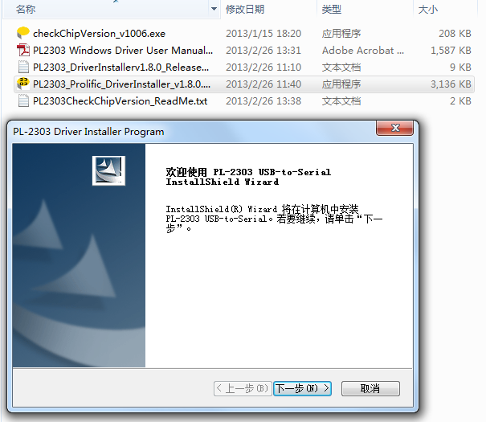

==================
零起点开始
==================

这是一份零起点的文档，对使用者几无嵌入式开发方面的经验要求，通过使用espush提供的云服务，最快速度实现云端（或手机APP）随时控制ESP8266开发板，主要控制开发板上IO口电平状态，从而实现控制开发板上LED灯的启停。至于完成后能做啥，就看你的想象力了。

-------------
准备工作
-------------

来看看我们需要准备些什么东东，硬件方面我们需要一块 **ESP8266开发板** ，这里推荐使用淘宝上比较普遍的ESP8266全IO引出板，这一块开发板引出了所有的GPIO口，方便进一步的开发。如下图所示的样子，买一块回来。为了避免广告之嫌，就不放链接了。

当然，你也可以使用其他的ESP8266开发板，淘宝搜索即可，但不同的开发板有不同的接入方式，驱动等，部分开发板IO口未引出，部分开发板IO口标注与芯片不一致，需要留意。另外，你还需要一根串口线以对其进行固件刷写，这里使用 **PL2303主控的串口TTL数据线** ，你可以淘宝搜索PL2303串口数据线，找到如下图所示的，买一个回来。

可选步骤：此开发板使用电池盒供电，使用3节7号电池即可点亮此开发板，芯片在电量不足时会出现莫名错误，建议使用电源适配器供电。将其简单改装，需要一个5V1A的电源适配器，电池盒剪下，焊上一个插头即可，成品如下图所示：

软件方面需要准备的，最重要的就是串口线驱动与调试工具，以及开发板的固件刷写工具。

与多数使用的工具不同，本教程使用 **XShell做为串口调试** 的工具，XShell一般做为开发人员或Linux运维人员连接服务器使用，但其依然能做为串口连接工具使用，且其针对个人用户免费使用，故在此推荐。百度XShell下载地址即可，可留意百度卫士哦。

固件刷写，即串口编程工具，此处使用官方的 **flash_download_tool** ，下载地址在这里：http://bbs.espressif.com/download/file.php?id=856

**串口线的驱动** 下载地址：http://www.prolific.com.tw/UserFiles/files/PL2303_Prolific_DriverInstaller_v1_8_0.zip

--------------
安装驱动
--------------

驱动的安装极为简单，将串口线接入PC的USB口后，系统默认状态下无法获取其驱动，并提示发现未知设备USB-Serial Controller，如下图所示

将下载的驱动解压，并双击PL2303_Prolific_DriverInstaller，简单跟随安装向导，安装完毕即可：

驱动安装完成后，在设备管理器中刷新，或等待几秒，使其自动刷新设备状态。若长时间设备未刷新，且名称前有黄色叹号，则可重新插拔数据线，直至系统的虚拟串口正常工作，如下图所示即可：

--------------
连接硬件
--------------

驱动安装完毕后，按下图所示的方式，连接串口线与开发板，如下图左侧黑框部分。一般地，白色线多为RX，黑色线为地线GND，红色线为DC+（电源从电池或适配器供电，未接入，置空。最好不要使用USB供电，因设备启动时瞬时电流较高，有烧坏USB的可能。），剩下一根颜色有多种，有绿色版的也有蓝色版本的为TX，将RX、TX、GND对应接入开发板一侧的排阵处，然后扣入电池或接上电源，连接即告完成。

刷写固件前，按芯片要求，需要将GPIO0口置为低电平状态，反映到开发板中，即扣上左侧的刷写帽即可。扣上短接帽后开发板中的某个LED灯将点亮，明亮的红色，如下图所示：

提示：左侧短接帽，扣上后为固件升级模式，芯片将无法使用正常的功能。短接帽拔下后为正常运行状态，正常使用时务必拔下。

--------------
刷入固件
--------------

开发板连接好后，将进入固件刷写步骤。需要留意的是，系统在同一时刻只能由一个应用程序打开串口，如正开着XShell窗口并连接到COM端口，则固件刷入工具将无法连接，所以应先断开XShell的连接（Alt-C快捷键）。

首先下载固件，https://espush.cn/web/down_roms/espush_at/ ，下载完毕后解压，可得到 ``blank.bin, eagle.flash.bin, eagle.irom0text.bin`` 三个文件；打开串口刷写工具，按下图所示选择，请 **重点留意ADDR区域的刷写偏移地址** ，并选择正确的COM端口。

.. image:: _static/images/quickstart/flash_begin.png

扣上开发板的短接帽，点击START按钮，重新扣上开发板电池，你会看到刷写进度，待其工作完毕即可。

.. image:: _static/images/quickstart/at_flashing.png

刷写完成后如图所示：

--------------
注册云平台
--------------

进入https://espush.cn/ 点击注册新用户，使用有效的邮箱注册登入后界面如下图所示，点击设备分类，在APP名称栏目处输入设备分类的名称，如此处的云测试设备，点击新增按钮。

新增设备完成后会出现一栏新的设备分类，下图中即ID为15233的列表项，此处的AppID与App Key稍后将有用到，至此注册完成。

--------------
串口工具配置
--------------

打开串口工具XShell，第一次启动时会弹出 **会话** 对话框，如未弹出，按 ``Alt-O-`` 快捷键即可，点击新建，选择会话，如下图。

在新建会话对话框中，随意输入会话名称，选择协议为SERIAL，并点击右侧树选框中的SERIAL栏目：

选择你机器中的正确的串口，或点击Port右侧的下拉按钮选择，配置Baud Rate（波特率）为115200：

点击右侧的终端-VT模式，选中New Line Mode（NLM）项目，点击确定，然后点击连接，就可以连上串口啦。

连接后你会看到简单的Connected的提示符，即告完成。

点击连接，即可连入串口，若出现下图的提示，请检查是否选择了正确的串口，刷写工具是否关闭（系统中只能由一个程序连入串口，刷写工具在固件刷写完成后会自动关闭串口，不影响调试工具的使用）。

--------------
连入网络与云
--------------

刷入固件完成后，打开XShell，并按Alt-O打开会话，连接前面配置好的串口，如无意外，可以看 **到Connected.** 的提示。同时拔下刷写短接帽，拔下电池并重新扣上，即重启开发板，屏幕闪过一阵乱码后将出现Ready的提示符，输入AT回车后，黑漆漆的命令行窗口将回应你OK。这是来自ESP8266开发板的第一声问候。如果你直接回车将得到ERROR的提示。

按下图中的指令逐个输入，当你在最后输入AT+PUSH?并得到2的回复后，连接即告完成。

-----------------
云端控制开发板
-----------------

进入云端控制台，点击在线设备，https://espush.cn/web/devices/ ，如果操作正确，此处的在线设备列表将能看到你的开发板，如下图所示：

右侧链接中，点击备注可以为开发板命名，更好的名称将显示在手机APP中，用以区分同一类别下不同的设备。此处点击推送，弹出下图的推送控制对话框，选择AT指令，输入一行指令 ``AT+GPIO_LOW=12`` (切记单行指令，不要回车换行)，即可打开开发板上的LED彩灯，看到了吗？

要是你没有留意开发板，再次点击推送，输入指令 ``AT+GPIO_HIGH=12`` 重新灭掉LED灯，再次点亮即可。关于这里的指令，可以在这里找到 http://bbs.espressif.com/viewtopic.php?f=67&t=225

--------------
开启手机控制
--------------

下载android手机APP，https://espush.cn/web/down_apk/ ，安装完成后，首先在电脑上打开管理后台， https://espush.cn/web/apps/ 点击设备分类后的二维码链接。

打开手机App ESPUSH，使用手机APP的 **扫描二维码添加** 功能扫描屏幕的二维码，添加完成后如下图：

设备分类名称将会显示在列表中，并会显示在线设备的数量。点击设备分类名，在线设备会列出其设备ID或设备名称：

点击设备ID或其设备名称后会出现可用的IO口控制器列表，点击每项列表后的切换按钮，可以观察到开发板上LED灯的启停。

--------------
后续
--------------

espush提供了ESP8266的固件、云平台，简易的手机APP。通过将继电器与开发板连接可以做 ``远程控制`` 的插座，这里有示例：http://blog.espush.cn/ten_minute_socket.html

通过将传感器与开发板连接，使用SDK开发包，可以实现 ``智能数据采集`` ，这里是一个简单的例子：http://blog.espush.cn/ten_minute_humiture_sensor.html

完成第一步后，你可以尝试使用espush提供的SDK开发包，第三方API接口，开始你的物联网之旅。

