=========
入门指引
=========

-------------
什么是ESP8266
-------------

ESP8266是一款由乐鑫公司开发的WIFI芯片，按其官网的描述

    ESP8266 是一款高度集成的芯片，该芯片专门针对无线连接的需求而开发，是一个完整且自成系统的 WiFi 网络解决方案。它能够搭载软件应用，也能通过另一个应用处理器卸载所有的 WiFi 网络功能。 ESP8266 具备强大的片上处理和存储功能，这使其可通过 GPIO 口集成传感器及其他应用的特定设备，既缩短前期开发时间，也最大限度减少运行中系统资源的占用。ESP8266 高度片内集成，仅需极少的外部电路，而其包括前端模块在内的整个解决方案，可将设计中 PCB 所占的空间降到最低。

ESP8266目前网络方面性能较弱，所以我们主要并不考察其性能，而关注其在极小的PCB板上、极精简的电路下，实现了稳定的WIFI通讯这一特性。

-------------
什么是ESPUSH
-------------

ES-PUSH是一个针对 乐鑫公司 http://espressif.com/ 的8266 WIFI物理网芯片开发的推送服务平台，具备实时远程数据及指令推送，数据收集与整理归纳，云端自动推送升级等功能。

ESP8266内置低功耗32位芯片，可兼作应用处理器，同时自带众多GPIO引脚，设置引脚复用后大大方便控制外部设备电路。这使得我们的物联网设备或其他需要wifi网络功能的设备模块无需额外集成CPU即可实现大部分功能，无疑是开发者的福音。

但ESP8266使用的TCP/IP编程与通常的Socket方式不同，其网络控制结构 **struct espconn** 基于对lwip的浅层封装实现，使用异步回调机制，给开发带来了诸多不变，往常的大量的基于socket的网络编程库与经验得不到重复使用。故此开发了这样一个数据推送平台。以期能为开发者分忧。

ES-PUSH只希望解决一个问题，即能在任何有网络的地方随时控制处于内网中的WIFI设备，譬如在公司里控制家里的wifi机器人小车，回家的路上使用4G网络控制家里的热水器开关、空调器开关等。

大多数市售的8266芯片都自带了Flash存储空间，我们可以理解为是8266这块CPU的硬盘，ESP8266的固件指的是存放于Flash内的指令代码，你可以认为是芯片的操作系统，虽然远没有他复杂。而Flash是可以刷写改变的，所以通过刷入不同的“操作系统”便可以针对性实现不同的功能，现流行的固件有AT固件与NodeMCU固件。

ESPUSH开发了不同的固件以适宜现有的8266生态，如深受广大电子朋友喜欢的AT固件，在官网AT固件基础上定制了GPIO控制指令与云平台连接指令，并针对小容量Flash特别的进行了适配。针对使用Lua语言编程的NodeMCU芯片，ESPUSH也针对性推出了相应的固件，并开源在了github上。

--------------------------
不同固件间的区别
--------------------------

我们一般使用AT固件是因为其简单，系统外部MCU通过串口与8266通讯。

如果我们有更高的要求，可以使用NodeMCU，使用了Lua编程语言，以Node.js 类似的语法实现更多的自定义功能

如果C语言基础好，且有更多的自定义要求，更精细化的控制要求，则可以使用官方提供的SDK进行自定义固件开发。

可以认为不同的需求构成了不同固件之间的区别，不同的固件是在使用上是平级的，并且无法同时使用，也就是说你使用了AT固件，那便无法执行Lua指令（Lua指令为NodeMCU固件所特有），而使用NodeMCU库，一般情况下便无法使用C语言进行更底层的开发（NodeMCU开源，也可以通过Lua C API对NodeMCU进行更深层次的控制，像ESPUSH做的一样，在NodeMCU中的ESPUSH即使用了这种形式)。

--------------------------
如何刷入ESPUSH
--------------------------

此处以安信可淘宝销售的小黄版 ESP8266-12 http://item.taobao.com/item.htm?id=42590859127 为例进行讲解，其他的如01模块等，可配备其对应的全功能测试版，更加方便，不再赘述。此款模块将IO口全部引出，且多数配置对应LED灯，方便GPIO开发于测试，并单独导出了RX于TX口，方便连接USB虚拟串口，这里需要使用TTL连接现，本文使用这一款： http://item.taobao.com/item.htm?id=39565945936，本文以win7操作系统为例，Linux及MacOS的童鞋们自行寻找对应驱动or工具。

首先连接，将TTL现的RX口、GND口、TX口接入小黄版对应接口上，TTL线的电源线置空不接，如下图，留意蓝色线为TX，白色线为RX，黑色对应GND，不要接错

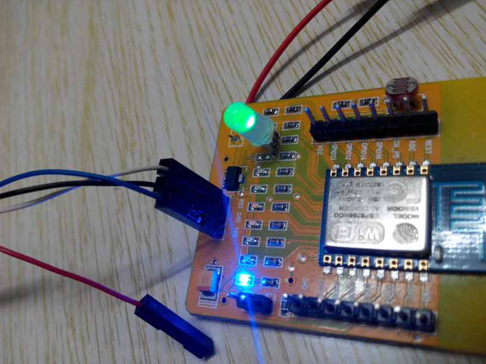

连好后接入系统USB口，检查小黄版的刷写帽是否扣上，如下图所示即为扣上了，如果没有请将其扣上，成功刷入后需将其取下方能进入正常运行模式。装上电池后，处于刷写模式时中间红色LED灯为高亮的状态，如下图所示。

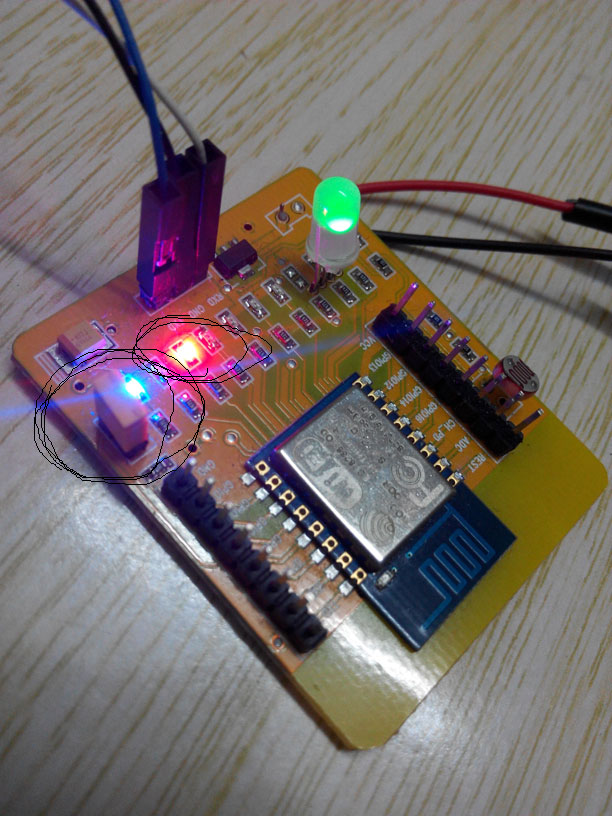

接线完毕后，将USB2TTL串口线USB端接入机器，装入对应的串口线驱动，本文的PL2303HX驱动在这里可以下载 http://www.prolific.com.tw/TW/ShowProduct.aspx?p_id=226&pcid=79，安装完成后，设备管理器里将出现串口，记下这里的串口号，如下图所示，即为安装成功。其他TTL数据线请自行寻找对应驱动。

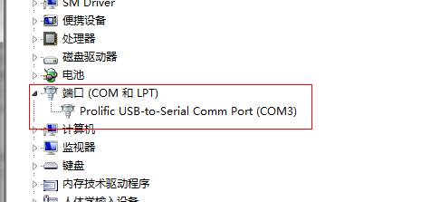

下载官网固件刷写工具： http://bbs.espressif.com/download/file.php?id=385，也可以使用NodeMCU的一键刷写工具，下载地址： https://github.com/nodemcu/nodemcu-flasher/raw/master/Win32/Release/ESP8266Flasher.exe，下面主要以官网的刷写工具为例进行讲解。

同时请下载ESPUSH的专属固件，下载地址在 https://espush.cn 首页，如下图所示，下载对应固件，本文以AT固件为例，请下载 **AT固件 for 1M+ flash** ，下载后解压。

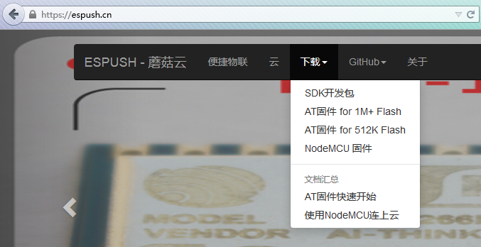

开启刷写工具，选择固件及固件偏移，如下图所示：

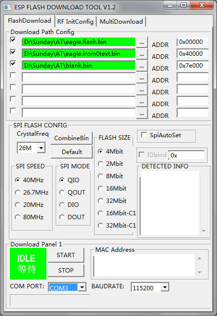

点击 **start** ，模块将进入刷写模式，屏幕提示等待上电同步中，此时请拔下一块电池，并重新装入，使之重新定位，让模块真正进入刷写模式，并开始刷写固件，如下图所示，正在刷写中，以及刷写完成后的界面：

等待上电同步

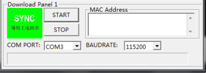

正在刷写中

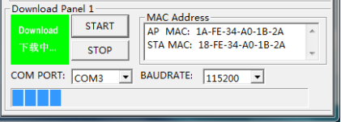

完成

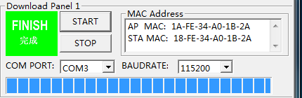

--------------------------------
串口调试助手及串口工具的使用
--------------------------------

刷写完成后，将刷写帽取下，对于ESP8266-01等其他模块，请将GPIO0悬空，使之进入正常运行模式，并重新上电，在重新上电前，我们需要配置好使用的串口工具。此部分请参考官方文档 **4B-ESP8266__AT Command Examples__CN_v0.4** ，下载地址位于此处 http://bbs.espressif.com/viewtopic.php?f=5&t=591 ，下载后解压，进入documents目录，选择对应语言后即可看到此份文档，对应文档中的 **使用指南** 章节部分进行设置，如下图所示：

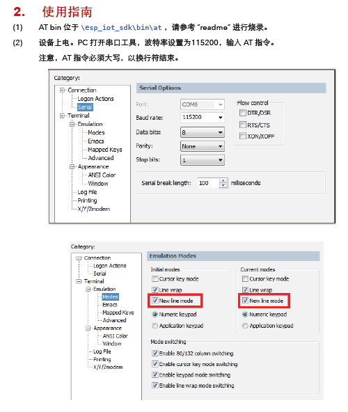

配置完成后，拉高GPIO0或拔出刷写帽，重新上电，模块将进入ESPUSH专属AT固件，尝试在你的终端工具中输入AT并回车试试看，你应该能看到他返回OK，尝试输入AT+GMR试试？

返回OK即为配置正常，返回AT或无返回或无法输入，均为波特率配置错误

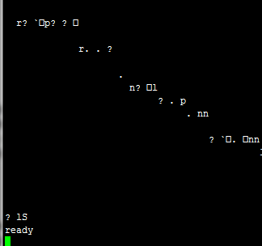

AT+GMR命令可以得知AT固件版本号及使用的SDK版本信息等，此处可以看到ESPUSH对应版本号。

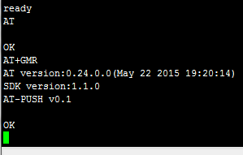
