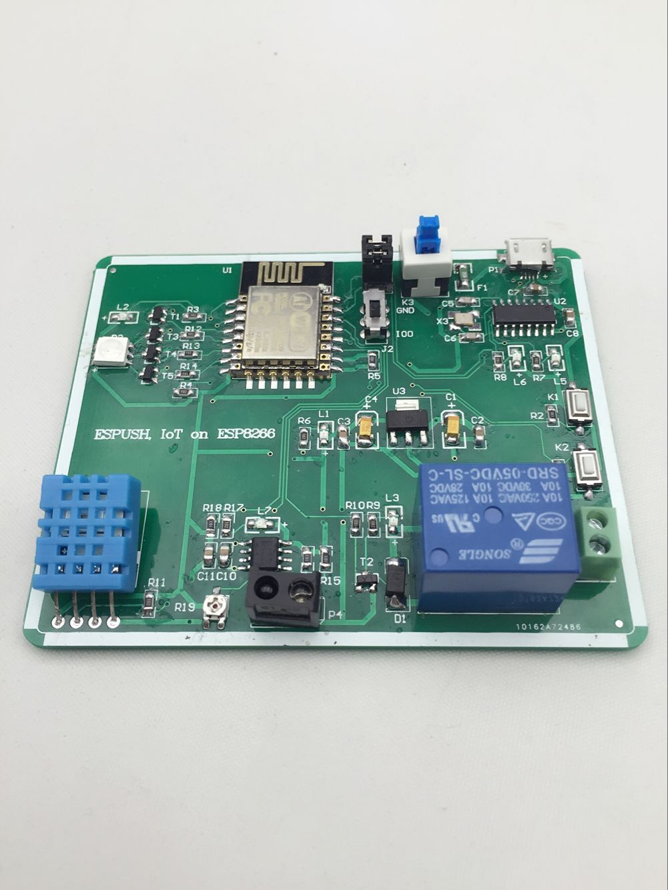
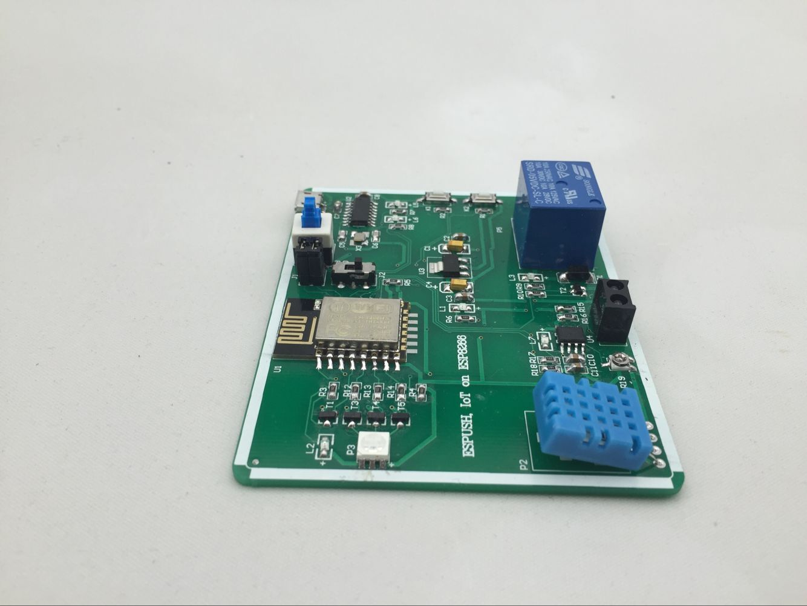
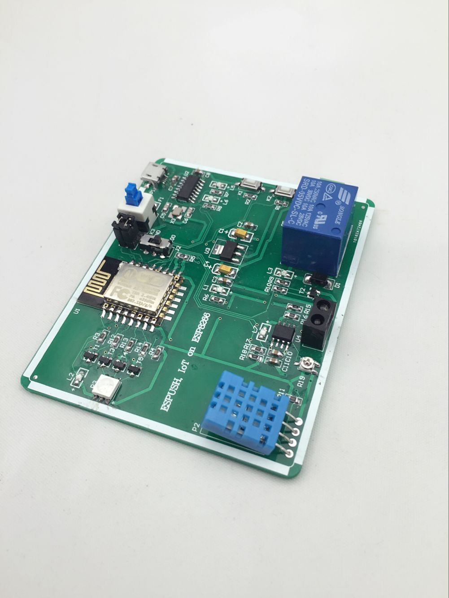
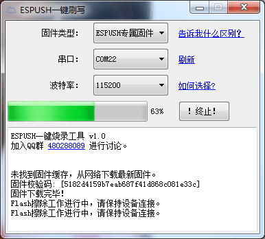
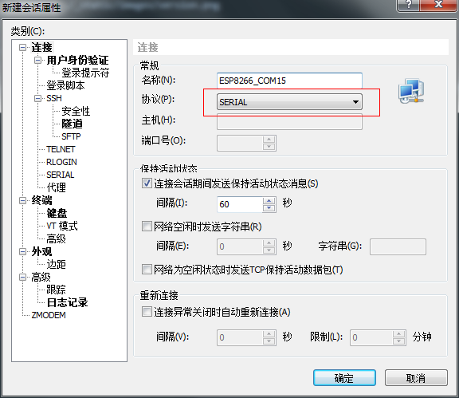
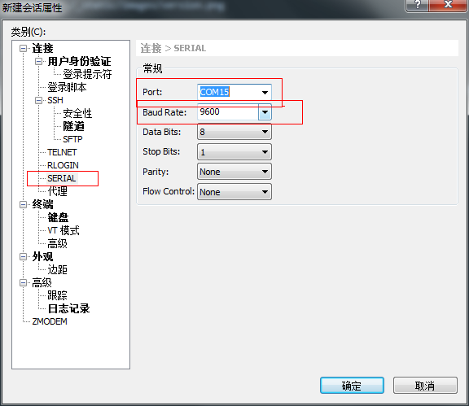
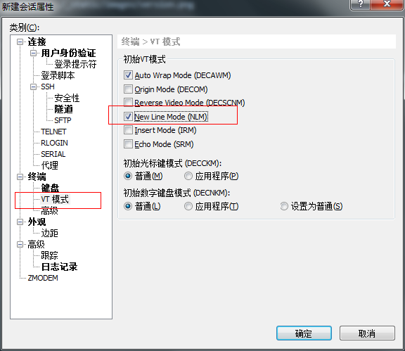

=========
入门指引
=========

-------------
什么是ESP8266
-------------

ESP8266是一款由乐鑫公司开发的WIFI芯片，按其官网的描述

    ESP8266 是一款高度集成的芯片，该芯片专门针对无线连接的需求而开发，是一个完整且自成系统的 WiFi 网络解决方案。它能够搭载软件应用，也能通过另一个应用处理器卸载所有的 WiFi 网络功能。 ESP8266 具备强大的片上处理和存储功能，这使其可通过 GPIO 口集成传感器及其他应用的特定设备，既缩短前期开发时间，也最大限度减少运行中系统资源的占用。ESP8266 高度片内集成，仅需极少的外部电路，而其包括前端模块在内的整个解决方案，可将设计中 PCB 所占的空间降到最低。

ESP8266目前网络方面性能较弱，所以我们主要并不考察其性能，而关注其在极小的PCB板上、极精简的电路下，实现了稳定的WIFI通讯这一特性。

-------------
什么是ESPUSH
-------------

ES-PUSH是一个针对 乐鑫公司 http://espressif.com/ 的8266 WIFI物理网芯片开发的推送服务平台，具备实时远程数据及指令推送，数据收集与整理归纳，云端自动推送升级等功能。

ESP8266内置低功耗32位芯片，可兼作应用处理器，同时自带众多GPIO引脚，设置引脚复用后大大方便控制外部设备电路。这使得我们的物联网设备或其他需要wifi网络功能的设备模块无需额外集成CPU即可实现大部分功能，无疑是开发者的福音。

但ESP8266使用的TCP/IP编程与通常的Socket方式不同，其网络控制结构 **struct espconn** 基于对lwip的浅层封装实现，使用异步回调机制，给开发带来了诸多不变，往常的大量的基于socket的网络编程库与经验得不到重复使用。故此开发了这样一个数据推送平台。以期能为开发者分忧。

ES-PUSH只希望解决一个问题，即能在任何有网络的地方随时控制处于内网中的WIFI设备，譬如在公司里控制家里的wifi机器人小车，回家的路上使用4G网络控制家里的热水器开关、空调器开关等。

大多数市售的8266芯片都自带了Flash存储空间，我们可以理解为是8266这块CPU的硬盘，ESP8266的固件指的是存放于Flash内的指令代码，你可以认为是芯片的操作系统，虽然远没有他复杂。而Flash是可以刷写改变的，所以通过刷入不同的“操作系统”便可以针对性实现不同的功能，现流行的固件有AT固件与NodeMCU固件。

ESPUSH开发了不同的固件以适宜现有的8266生态，如深受广大电子朋友喜欢的AT固件，在官网AT固件基础上定制了GPIO控制指令与云平台连接指令，并针对小容量Flash特别的进行了适配。针对使用Lua语言编程的NodeMCU芯片，ESPUSH也针对性推出了相应的固件，并开源在了github上。

平台可实时针对单个设备、或按应用区分的某种指定类型所属设备进行自定义数据推送，推送的数据在模块上以回调函数的方式被定义（SDK方式）或串口输出（AT固件），您可以再此基础上定义自己的各项功能，如发送特殊指令以实现GPIO使能、控制串口通讯、驱动PWM、重启模块等操作。GPIO使能如简单的点亮LED、复杂的如控制各种外围设备等。 客户端可随时复用ESPUSH的连接向服务端推送数据，如各项传感器的数值、模块工作状态、终端逻辑数据等。上传的数据可通过Web控制台浏览，亦可通过服务端SDK将数据同步回开发者。 云端控制台可针对单个设备、所有设备或某种应用类型设备进行，可清晰的观察到设备升级进度及升级结果是否成功，可针对测试设备升级成功后再行规模化推送。

--------------------------
不同固件间的区别
--------------------------

我们一般使用AT固件是因为其简单，系统外部MCU通过串口与8266通讯。

如果我们有更高的要求，可以使用NodeMCU，使用了Lua编程语言，以Node.js 类似的语法实现更多的自定义功能

如果C语言基础好，且有更多的自定义要求，更精细化的控制要求，则可以使用官方提供的SDK进行自定义固件开发。

可以认为不同的需求构成了不同固件之间的区别，不同的固件是在使用上是平级的，并且无法同时使用，也就是说你使用了AT固件，那便无法执行Lua指令（Lua指令为NodeMCU固件所特有），而使用NodeMCU库，一般情况下便无法使用C语言进行更底层的开发（NodeMCU开源，也可以通过Lua C API对NodeMCU进行更深层次的控制，像ESPUSH做的一样，在NodeMCU中的ESPUSH即使用了这种形式)。

--------------------------
如何刷入ESPUSH
--------------------------

**ESPUSH** 专属开发板已上线， https://item.taobao.com/item.htm?id=523362788057 开发测试更为方便，配备温湿度传感器、红外传感器、按钮一件配置、光耦继电器、LED、三色彩灯等，全方位覆盖物联网开发方方面面，不使用额外单片机，释放ESP8266最大能量，使用普通Android手机数据线即可连接，开发测试从此不用单独飞线，一切以你的开发效率着想。

ESPUSH IoT on ESP8266

点这里下载驱动程序，连入系统，待驱动安装完毕，正常情况下系统中的虚拟串口会生成，如下图：

下载官网固件刷写工具： http://bbs.espressif.com/download/file.php?id=385，也可以使用NodeMCU的一键刷写工具，下载地址： https://github.com/nodemcu/nodemcu-flasher/raw/master/Win32/Release/ESP8266Flasher.exe，下面主要以官网的刷写工具为例进行讲解。

同时请下载ESPUSH的专属固件，下载地址在 https://espush.cn 首页，如下图所示，下载对应固件，本文以AT固件为例，请下载 **AT固件 for 1M+ flash** ，下载后解压。

开启刷写工具，选择固件及固件偏移，如下图所示：

点击 **start** ，模块将进入刷写模式，屏幕提示等待上电同步中，此时请拔下一块电池，并重新装入，使之重新定位，让模块真正进入刷写模式，并开始刷写固件，如下图所示，正在刷写中，以及刷写完成后的界面：

等待上电同步

正在刷写中

完成

.. image:: ./_static/images/flashed.png

--------------------------------
使用ESPUSH专用刷写工具
--------------------------------

下载ESPUSH固件专属刷写工具，无需下载固件，只需要选择目标串口，即可一键完成刷写。 http://pan.baidu.com/s/1bpwnBiv

--------------------------------
串口工具的配置
--------------------------------

刷写完成后，将刷写帽取下，对于ESP8266-01等其他模块，请将GPIO0悬空，使之进入正常运行模式，并重新上电，在重新上电前，我们需要配置好使用的串口工具。此部分请参考官方文档 **4B-ESP8266__AT Command Examples__CN_v0.4** ，下载地址位于此处 http://bbs.espressif.com/viewtopic.php?f=5&t=591 ，下载后解压，进入documents目录，选择对应语言后即可看到此份文档，对应文档中的 **使用指南** 章节部分进行设置，如下图所示：

配置完成后，拉高GPIO0或拔出刷写帽，重新上电，模块将进入ESPUSH专属AT固件，尝试在你的终端工具中输入AT并回车试试看，你应该能看到他返回OK，尝试输入AT+GMR试试？

返回OK即为配置正常，返回AT或无返回或无法输入，均为波特率配置错误

AT+GMR命令可以得知AT固件版本号及使用的SDK版本信息等，此处可以看到ESPUSH对应版本号。

如果您使用XShell工具而非图示的secureCRT，则参考如下图示完成配置：

选择串口，并为其命名后，点击 Serial 继续

配置串口的波特率，留意AT固件一般使用的波特率为115200，NodeMCU使用的波特率为9600，您可以在启动源码中自行修改此值。

在「终端」的「VT」选项卡中，务必选中 「New Line Mode」选项，完毕后连接即可。

---------------
手机APP
---------------

此处下载手机APP https://github.com/pushdotccgzs/espush_app 克隆后bin目录即为最新的手机APP，使用了基于HTML5技术的MUI框架完成，熟悉安卓开发的工程师可自行根据服务端SDK进行开发。

